# 💰 PEMS - Personal Expense Management System

A full-stack web application to track personal income, expenses, and savings with a beautiful dashboard and real-time analytics.


---

## 📖 Table of Contents

- [About the Project](#-about-the-project)
- [Features](#-features)
- [Tech Stack](#️-tech-stack)
- [Architecture](#️-architecture)
- [Screenshots](#-screenshots)
- [Getting Started](#-getting-started)
    - [Using Docker (Recommended)](#using-docker-recommended-)
    - [Manual Setup](#manual-setup-️)
- [API Documentation](#-api-documentation)
- [Project Structure](#-project-structure)
- [Database Schema](#️-database-schema)
- [Security](#-security)
- [Future Enhancements](#-future-enhancements)
- [Contributing](#-contributing)
- [License](#-license)
- [Author](#-author)

---

## 🎯 About the Project

**PEMS (Personal Expense Management System)** is a full-stack web application that helps users take control of their personal finances. Users can track daily income and expenses, categorize transactions, visualize spending patterns with interactive charts, and monitor their monthly savings — all secured with JWT-based authentication.

This project demonstrates **production-grade full-stack development** including REST API design, database modeling, JWT authentication, containerization, and modern frontend development with React.

### Why PEMS?

- 📊 **Real-time Analytics** — Visualize where your money goes
- 🔐 **Secure** — JWT authentication with BCrypt password hashing
- 🐳 **One-Command Setup** — Docker Compose runs everything
- 📱 **Responsive** — Works on desktop, tablet, and mobile
- 🚀 **Production-Ready** — Nginx-served React build, layered backend

---

## ✨ Features

### 🔐 Authentication & Security
- JWT (JSON Web Token) based stateless authentication
- BCrypt password hashing (passwords never stored in plain text)
- Protected routes on both frontend and backend
- CORS configuration for secure cross-origin requests
- Global exception handling with consistent error responses

### 💸 Expense Management
- Add / Edit / Delete expenses
- Categorize expenses (Food, Travel, Shopping, Bills, Health, etc.)
- Filter by category and date range
- Pagination support for large datasets
- Multiple payment methods (UPI, Cash, Card, Net Banking)

### 💰 Income Management
- Add / Edit / Delete incomes
- Categorize incomes (Salary, Freelance, Business, Investment, Gift, etc.)
- Filter by category and date range
- Full CRUD operations

### 📊 Dashboard & Analytics
- **Cards:** Total Income, Total Expense, Net Savings, Monthly Income, Monthly Expense, Monthly Savings, Today's Expense, Total Transactions
- **Pie Charts:** Category-wise expense and income breakdown
- **Bar Chart:** Income vs Expense comparison (Total & Monthly)

### 🗂️ Category Management
- Separate categories for income and expenses
- Full CRUD operations
- Pre-seeded default categories

### 🐳 DevOps
- Fully Dockerized (Frontend + Backend + Database)
- One-command startup with Docker Compose
- Nginx serving the production build of the React app
- Multi-stage Docker builds for optimized image sizes
- Persistent MySQL volume for data safety

---

## 🛠️ Tech Stack

### Backend
| Technology | Purpose |
|-----------|---------|
| **Java 21** | Programming Language |
| **Spring Boot 4.1.1** | Backend Framework |
| **Spring Security** | Authentication & Authorization |
| **Spring Data JPA** | ORM / Database Access |
| **Hibernate** | JPA Implementation |
| **JWT (jjwt 0.13)** | Token-based Auth |
| **MySQL 8** | Relational Database |
| **Maven** | Build Tool |
| **Swagger / OpenAPI 3** | API Documentation |
| **Bean Validation** | Input Validation |

### Frontend
| Technology | Purpose |
|-----------|---------|
| **React 19** | UI Library |
| **Vite** | Build Tool / Dev Server |
| **React Router v7** | Client-side Routing |
| **Axios** | HTTP Client with Interceptors |
| **Recharts** | Data Visualization |
| **CSS3** | Custom Styling |

### DevOps
| Technology | Purpose |
|-----------|---------|
| **Docker** | Containerization |
| **Docker Compose** | Multi-container Orchestration |
| **Nginx** | Web Server for Frontend |

---

## 🏗️ Architecture

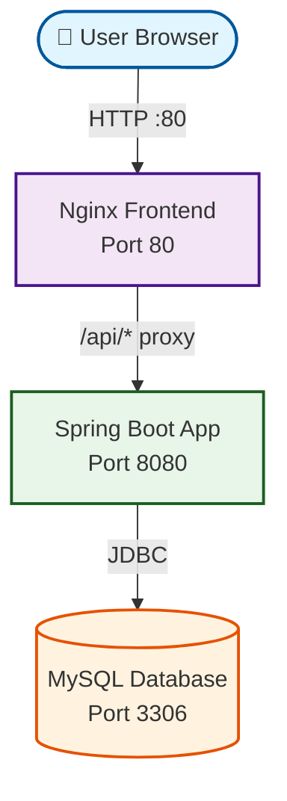

### Layered Backend Architecture

```text
Controller  →  Service  →  Repository  →  Entity  →  Database
   (API)      (Logic)      (Data Access)  (Tables)    (MySQL)
```

### 🔐 Authentication Flow

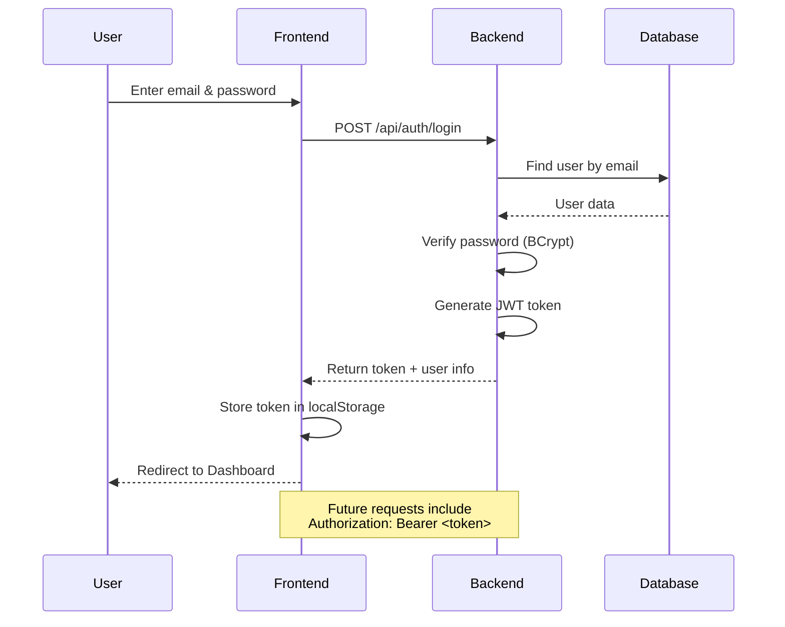

### Data Flow

1. **User Browser** sends HTTP request to Nginx.
2. **Nginx** serves the React app and proxies `/api/*` requests to the backend.
3. **Spring Boot** verifies the JWT token and executes business logic in the service layer.
4. **Hibernate/JPA** fetches or persists data in **MySQL**.
5. Response travels back the same route to the user.

---

## 📸 Screenshots

> 💡 **Add your screenshots in `docs/screenshots/` and uncomment below:**
### Login Page
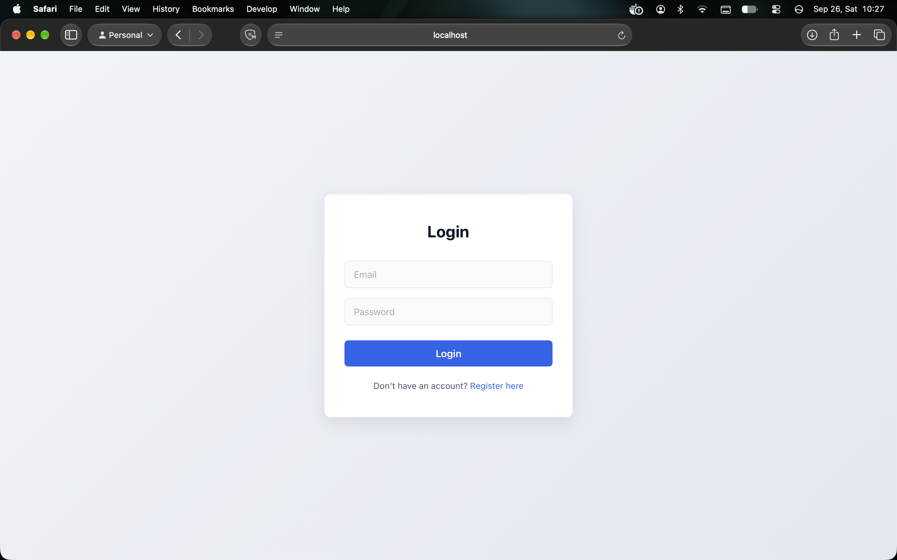

### Register Page
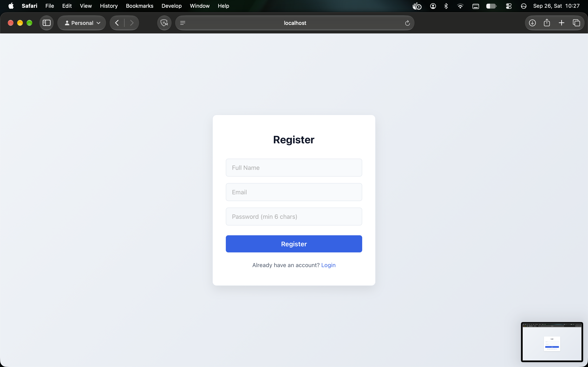

### Dashboard
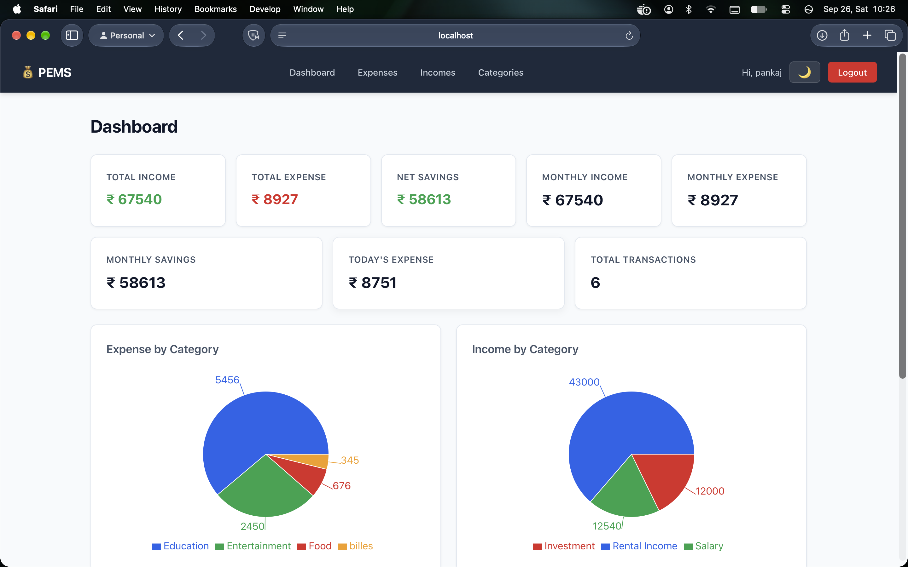

### Dashboard with Charts
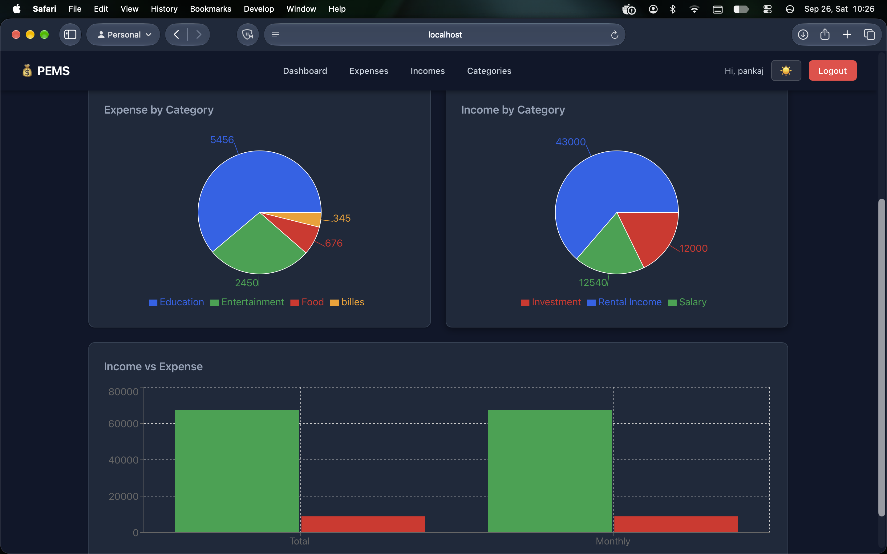

### Dashboard Night
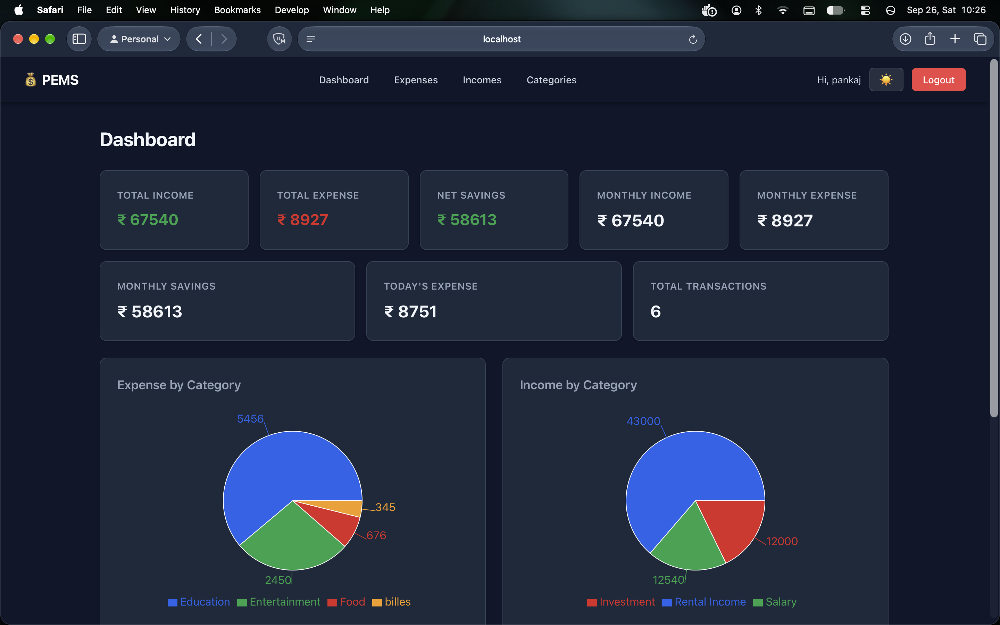

### Expenses
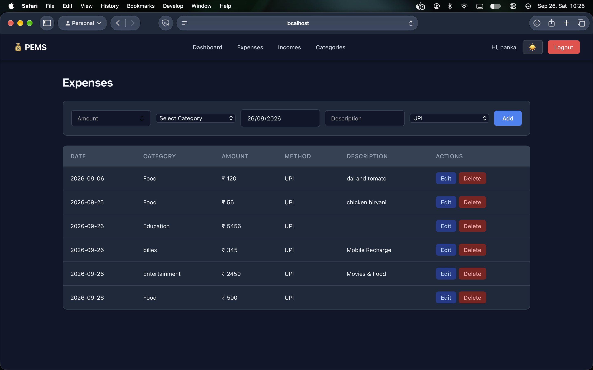

### Incomes
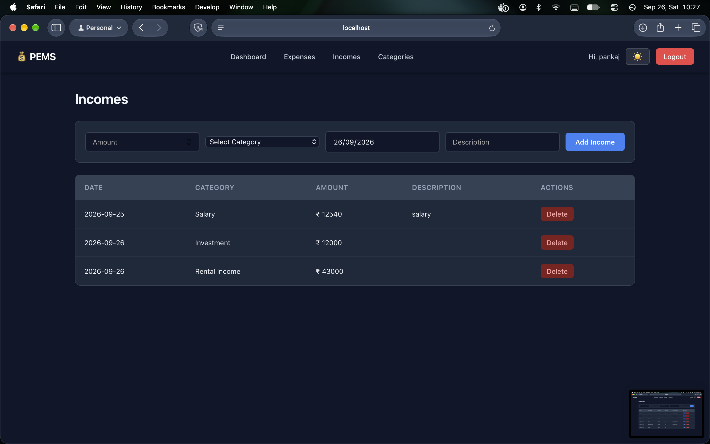

### Categories
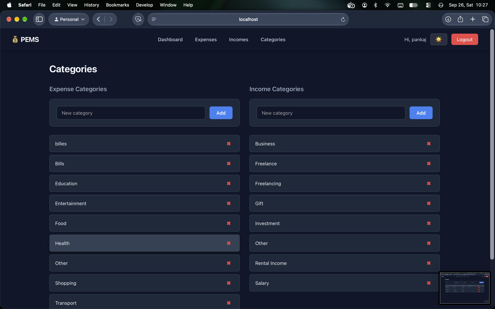

---

## 🚀 Getting Started

Follow these steps to run the project on your local machine.

### 📋 Prerequisites

Before you begin, make sure you have:

- **Docker Desktop** installed — [Download here](https://www.docker.com/products/docker-desktop)
    - For Windows: Enable WSL 2 during installation
    - For Mac: Choose the right chip (Intel / Apple Silicon)
- **Git** installed — [Download here](https://git-scm.com/downloads)

That's it! Docker will handle Java, Node.js, MySQL, and everything else.

> 💡 **No Docker?** Jump to the [Manual Setup](#manual-setup-️) section below.

---

### 🐳 Quick Start with Docker (Recommended)

#### Step 1: Clone the Repository

```bash
git clone https://github.com/pankajkevat21/personal-expense-management-system.git
cd pems
```

#### Step 2: Set Up Environment Variables

Create a `.env` file in the root directory:

```bash
# Generate a secure JWT secret (Base64)
# Mac/Linux:
openssl rand -base64 64

# Windows (PowerShell):
[Convert]::ToBase64String((1..64 | ForEach-Object { Get-Random -Maximum 256 }))
```

Copy the output and create a `.env` file with:

```env
JWT_SECRET=<paste-your-generated-secret-here>
DB_PASSWORD=rootpassword
```

> ⚠️ **Never commit `.env` to Git!** It's already in `.gitignore`.

#### Step 3: Start All Services

```bash
docker-compose up --build
```

**First run will take 3-5 minutes** (downloads dependencies). Subsequent runs are much faster.

#### Step 4: Access the Application

Once you see logs like `Started PemsApplication` and `nginx: ready`, open:

| Service | URL | Credentials |
|---------|-----|-------------|
| 🌐 **Frontend** | http://localhost | Register a new account |
| 📚 **Swagger UI** | http://localhost:8080/swagger-ui.html | — |
| 🗄️ **MySQL** | localhost:3307 | root / rootpassword |

#### Step 5: Try It Out!

1. Go to http://localhost/register
2. Create an account (email + password)
3. Login with the same credentials
4. Add some categories (Food, Salary, etc.)
5. Add an income and an expense
6. Check out the Dashboard with charts! 📊

#### Stopping the Application

```bash
# Stop containers (data is preserved)
docker-compose down

# Stop AND delete all data (fresh start)
docker-compose down -v
```

#### Viewing Logs

```bash
# All services
docker-compose logs -f

# Specific service
docker-compose logs -f backend
docker-compose logs -f frontend
docker-compose logs -f mysql
```

---

### 🛠️ Manual Setup

If you prefer running services directly (without Docker):

#### Prerequisites

- **Java 21** — [Download](https://adoptium.net/)
- **Node.js 20+** — [Download](https://nodejs.org/)
- **MySQL 8** — [Download](https://dev.mysql.com/downloads/mysql/)

#### Step 1: Set Up MySQL Database

Open MySQL and run:

```sql
CREATE DATABASE pems_db;
USE pems_db;
```

Then run the `init.sql` file:

```bash
mysql -u root -p pems_db < init.sql
```

This creates all tables and seeds default categories.

#### Step 2: Configure Backend

Set environment variables:

**Mac/Linux:**
```bash
export DB_PASSWORD=your_mysql_root_password
export JWT_SECRET=$(openssl rand -base64 64)
```

**Windows (PowerShell):**
```powershell
$env:DB_PASSWORD="your_mysql_root_password"
$env:JWT_SECRET=[Convert]::ToBase64String((1..64 | ForEach-Object { Get-Random -Maximum 256 }))
```

Update `src/main/resources/application.properties` if your MySQL runs on a different host/port.

#### Step 3: Run Backend

```bash
cd pems
./mvnw spring-boot:run
```

Backend runs at: **http://localhost:8080**

#### Step 4: Run Frontend

Open a new terminal:

```bash
cd pems-frontend
npm install
npm run dev
```

Frontend runs at: **http://localhost:5173**

> 💡 Vite is configured to proxy `/api/*` requests to `http://localhost:8080`.

---

### ❓ Troubleshooting

#### Port 80 or 8080 already in use?

**Solution:** Change the port in `docker-compose.yml`:

```yaml
frontend:
  ports:
    - "3000:80"    # Access at http://localhost:3000

backend:
  ports:
    - "8081:8080"  # Access at http://localhost:8081
```

#### Backend fails to connect to MySQL?

**Solution:** Make sure MySQL container is healthy first:

```bash
docker-compose logs mysql
```

Wait for `ready for connections`, then restart backend:

```bash
docker-compose restart backend
```

#### `401 Unauthorized` on every request?

**Solution:** Your JWT token may have expired (24-hour expiry). Log out and log in again.

#### Database has old data after code changes?

**Solution:** Wipe the volume and start fresh:

```bash
docker-compose down -v
docker-compose up --build
```

#### Frontend shows blank page?

**Solution:** Check browser console (F12) for errors. Verify frontend container is running:

```bash
docker ps
docker-compose logs frontend
```

---

### 🎬 One-Minute Demo (For the Impatient)

```bash
git clone https://github.com/your-username/pems.git
cd pems
echo "JWT_SECRET=$(openssl rand -base64 64)" > .env
echo "DB_PASSWORD=rootpassword" >> .env
docker-compose up --build
```

Then open http://localhost and register. Done! 🎉

---

## 📚 API Documentation

Once the backend is running, access **Swagger UI** at:

```
http://localhost:8080/swagger-ui.html
```

### Main API Endpoints

| Method | Endpoint | Description | Auth Required |
|--------|----------|-------------|---------------|
| `POST` | `/api/auth/login` | User login | ❌ |
| `POST` | `/api/users` | Register new user | ❌ |
| `GET` | `/api/users` | Get all users | ✅ |
| `GET` | `/api/expenses` | Get all expenses (paginated) | ✅ |
| `POST` | `/api/expenses` | Create expense | ✅ |
| `PUT` | `/api/expenses/{id}` | Update expense | ✅ |
| `DELETE` | `/api/expenses/{id}` | Delete expense | ✅ |
| `GET` | `/api/incomes` | Get all incomes | ✅ |
| `POST` | `/api/incomes` | Create income | ✅ |
| `PUT` | `/api/incomes/{id}` | Update income | ✅ |
| `DELETE` | `/api/incomes/{id}` | Delete income | ✅ |
| `GET` | `/api/dashboard` | Get dashboard analytics | ✅ |
| `GET` | `/api/categories` | Get expense categories | ✅ |
| `POST` | `/api/categories` | Create expense category | ✅ |
| `GET` | `/api/income-categories` | Get income categories | ✅ |
| `POST` | `/api/income-categories` | Create income category | ✅ |

### Authentication

All protected endpoints require a Bearer token in the header:

```
Authorization: Bearer <your_jwt_token>
```

---

## 📁 Project Structure

```
pems/
├── src/main/java/com/example/pems/
│   ├── config/              # Security, CORS, OpenAPI config
│   │   ├── SecurityConfig.java
│   │   ├── CorsConfig.java
│   │   └── OpenApiConfig.java
│   ├── controller/          # REST API endpoints
│   │   ├── AuthController.java
│   │   ├── UserController.java
│   │   ├── ExpenseController.java
│   │   ├── IncomeController.java
│   │   ├── CategoryController.java
│   │   ├── IncomeCategoryController.java
│   │   └── DashboardController.java
│   ├── dto/                 # Data Transfer Objects
│   │   ├── LoginRequest.java
│   │   ├── DashboardResponse.java
│   │   └── ErrorResponse.java
│   ├── entity/              # JPA entities (DB tables)
│   │   ├── User.java
│   │   ├── Expense.java
│   │   ├── Income.java
│   │   ├── Category.java
│   │   └── IncomeCategory.java
│   ├── exception/           # Global exception handling
│   │   ├── GlobalExceptionHandler.java
│   │   ├── ResourceNotFoundException.java
│   │   └── BadRequestException.java
│   ├── repository/          # Data access layer
│   ├── security/            # JWT filter
│   │   └── JwtAuthenticationFilter.java
│   └── service/             # Business logic
├── src/main/resources/
│   └── application.properties
├── pems-frontend/
│   ├── src/
│   │   ├── api/             # Axios instance with interceptors
│   │   ├── components/      # Navbar, ProtectedRoute
│   │   ├── pages/           # Login, Register, Dashboard, Expenses, Incomes, Categories
│   │   └── App.jsx
│   ├── nginx.conf           # Nginx config with /api proxy
│   ├── vite.config.js       # Dev proxy to backend
│   ├── package.json
│   └── Dockerfile
├── init.sql                 # DB schema + seed data
├── Dockerfile               # Backend Dockerfile (multi-stage)
├── .dockerignore
├── docker-compose.yml       # Multi-container setup
├── pom.xml
└── README.md
```

---

## 🗄️ Database Schema

### ER Diagram

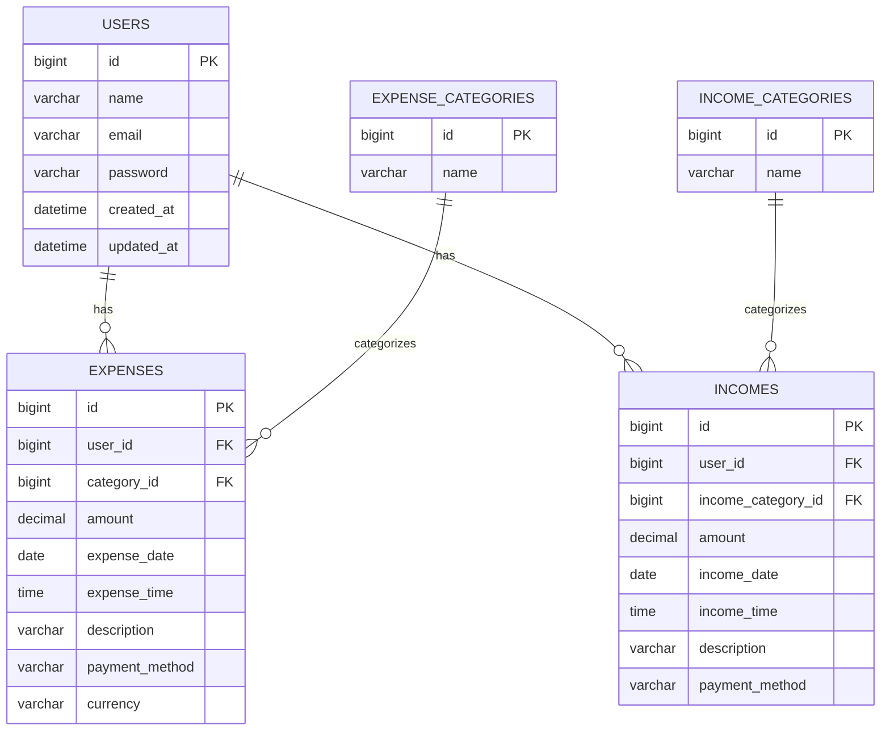

### Tables

#### `users`
| Column | Type | Notes |
|--------|------|-------|
| id | BIGINT | PK, Auto-increment |
| name | VARCHAR(100) | Not null |
| email | VARCHAR(150) | Unique, Not null |
| password | VARCHAR(255) | BCrypt hashed |
| created_at | DATETIME | Auto-set |
| updated_at | DATETIME | Auto-set |

#### `expenses`
| Column | Type | Notes |
|--------|------|-------|
| id | BIGINT | PK |
| user_id | BIGINT | FK → users |
| category_id | BIGINT | FK → expense_categories |
| amount | DECIMAL(12,2) | Not null |
| expense_date | DATE | Not null |
| payment_method | VARCHAR(255) | UPI, Cash, Card |
| description | VARCHAR(500) | Optional |

#### `incomes`
Similar to expenses with `income_category_id` and `income_date`.

#### `expense_categories` / `income_categories`
| Column | Type | Notes |
|--------|------|-------|
| id | BIGINT | PK |
| name | VARCHAR(100) | Unique, Not null |

---

## 🔒 Security

- **JWT Authentication** — Tokens signed with HMAC-SHA, expire after 24 hours
- **BCrypt Password Hashing** — Passwords never stored in plain text
- **Stateless Sessions** — No server-side session storage
- **CORS** — Only whitelisted origins (`localhost:*`, `127.0.0.1:*`) can access the API
- **Input Validation** — All DTOs use Bean Validation (`@NotNull`, `@Size`, `@Email`, etc.)
- **Global Exception Handler** — Consistent error responses with proper HTTP status codes
- **Environment Variables** — Secrets (DB password, JWT secret) never hardcoded

---

## 🚧 Future Enhancements

- [ ] Budget management with alerts
- [ ] Recurring transactions (auto salary/rent)
- [ ] Export reports to PDF/CSV
- [ ] Email notifications for monthly summary
- [ ] Multi-currency support
- [ ] Mobile app (React Native)
- [ ] Bill reminders
- [ ] Receipt image upload
- [ ] Unit & integration tests (JUnit + Mockito)
- [ ] CI/CD pipeline (GitHub Actions)

---

## 🤝 Contributing

Contributions, issues, and feature requests are welcome!

1. Fork the repository
2. Create a feature branch (`git checkout -b feature/AmazingFeature`)
3. Commit your changes (`git commit -m 'Add some AmazingFeature'`)
4. Push to the branch (`git push origin feature/AmazingFeature`)
5. Open a Pull Request

---

## 📄 License

This project is licensed under the **MIT License**. See the [LICENSE](LICENSE) file for details.

---

## 👤 Author

**Pankaj Kevat**

- 📧 Email: pankajkevat21@gmail.com
-  🔗 **LinkedIn:** [Pankaj Kevat](https://www.linkedin.com/in/pankaj-kevat-89393a3a6/)
- 🐙 GitHub: [@pankajkevat21](https://github.com/pankajkevat21/)

---

## ⭐ Show Your Support

If you liked this project, please give it a ⭐ on GitHub — it motivates me to build more!

---

<div align="center">

**Built with ❤️ using Spring Boot & React**

</div>