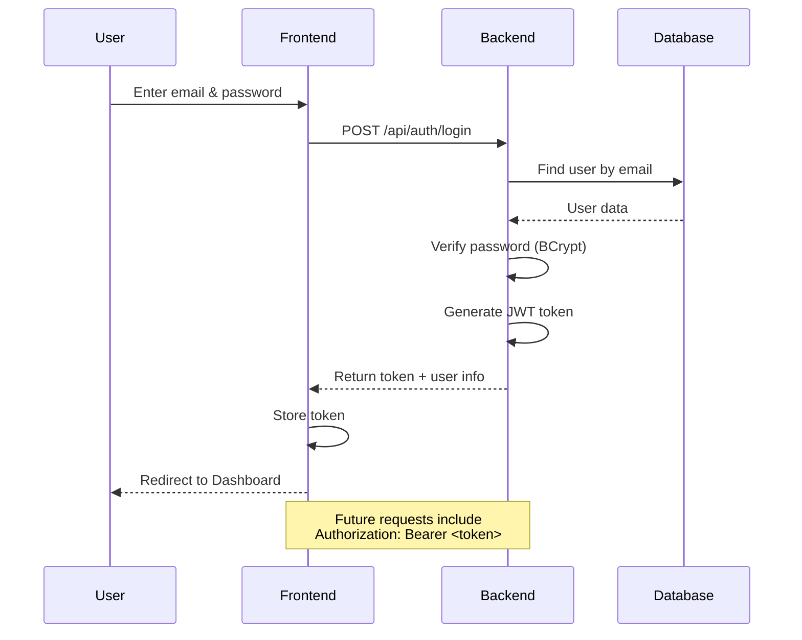
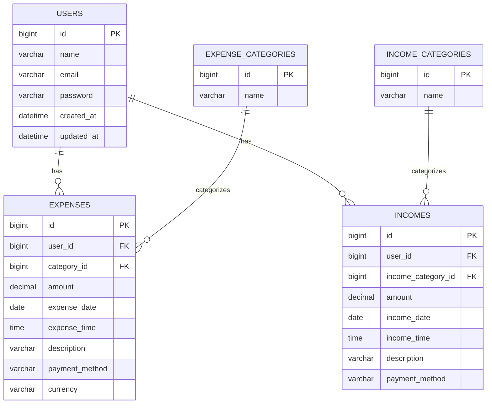

# 💰 PEMS — Personal Expense Management System

A full-stack personal finance management web application for tracking **income, expenses, categories, and savings** with an interactive dashboard, analytics, JWT authentication, and Dockerized deployment.


---

##  Table of Contents

* [About the Project](#-about-the-project)
* [Why PEMS?](#-why-pems)
* [Features](#-features)
* [Tech Stack](#️-tech-stack)
* [Architecture](#️-architecture)
* [Screenshots](#-screenshots)
* [Getting Started](#-getting-started)

  * [Prerequisites](#prerequisites)
  * [Docker Setup](#-docker-setup-recommended)
  * [Manual Setup](#-manual-setup)
* [Environment Variables](#-environment-variables)
* [API Documentation](#-api-documentation)
* [Project Structure](#-project-structure)
* [Database Schema](#️-database-schema)
* [Security](#-security)
* [Troubleshooting](#-troubleshooting)
* [Testing](#-testing)
* [Future Enhancements](#-future-enhancements)
* [Contributing](#-contributing)
* [License](#-license)
* [Author](#-author)
* [Show Your Support](#-show-your-support)

---

##  About the Project

**PEMS (Personal Expense Management System)** is a full-stack web application designed to help users manage their personal finances in one place.

Users can:

* Track daily income and expenses
* Organize transactions into categories
* Filter transactions by category and date
* Monitor monthly income, expenses, and savings
* Visualize financial data using interactive charts
* Manage income and expense categories
* Secure their account using JWT-based authentication

The project demonstrates full-stack development using **Spring Boot, React, MySQL, REST APIs, JWT authentication, Docker, and Nginx**.

---

## 💡 Why PEMS?

*  **Real-Time Analytics** — Understand spending and income patterns through visual dashboards
*  **Secure Authentication** — JWT authentication with BCrypt password hashing
*  **Dockerized** — Frontend, backend, and database can run together using Docker Compose
*  **Responsive UI** — Designed to work across desktop, tablet, and mobile screens
*  **REST API Architecture** — Clean separation between frontend and backend
*  **Persistent Database** — MySQL data is stored using Docker volumes
*  **API Documentation** — Swagger/OpenAPI documentation included

---

# ✨ Features

##  Authentication & Security

* JWT-based stateless authentication
* BCrypt password hashing
* Protected frontend routes
* Protected backend REST endpoints
* CORS configuration
* Bean Validation for request data
* Global exception handling
* Environment-based configuration for sensitive values

---

##  Expense Management

* Add expenses
* Edit expenses
* Delete expenses
* Categorize expenses
* Filter by category
* Filter by date range
* Pagination support
* Multiple payment methods:

  * UPI
  * Cash
  * Card
  * Net Banking

---

##  Income Management

* Add income
* Edit income
* Delete income
* Categorize income
* Filter by category
* Filter by date range
* Full CRUD operations
* Income categories such as:

  * Salary
  * Freelance
  * Business
  * Investment
  * Gift

---

##  Dashboard & Analytics

The dashboard provides an overview of the user's financial activity.

### Summary Cards

* Total Income
* Total Expense
* Net Savings
* Monthly Income
* Monthly Expense
* Monthly Savings
* Today's Expense
* Total Transactions

### Charts

* Category-wise expense breakdown
* Category-wise income breakdown
* Income vs Expense comparison
* Total and monthly financial comparisons

---

## ️ Category Management

* Separate income and expense categories
* Create categories
* Read categories
* Update categories
* Delete categories
* Pre-seeded default categories

---

## 🐳 DevOps & Docker

* Dockerized frontend
* Dockerized backend
* Dockerized MySQL database
* Docker Compose orchestration
* Multi-stage Docker builds
* Nginx production server
* Persistent MySQL volume
* One-command application startup

---

#  Tech Stack

## Backend

| Technology              | Purpose                        |
| ----------------------- | ------------------------------ |
| **Java 21**             | Programming Language           |
| **Spring Boot 4.1.1**   | Backend Framework              |
| **Spring Security**     | Authentication & Authorization |
| **Spring Data JPA**     | Database Access                |
| **Hibernate**           | JPA Implementation             |
| **JWT / jjwt 0.13**     | Token-based Authentication     |
| **MySQL 8**             | Relational Database            |
| **Maven**               | Build Tool                     |
| **Swagger / OpenAPI 3** | API Documentation              |
| **Bean Validation**     | Input Validation               |

## Frontend

| Technology          | Purpose                         |
| ------------------- | ------------------------------- |
| **React 19**        | UI Library                      |
| **Vite**            | Build Tool / Development Server |
| **React Router v7** | Client-side Routing             |
| **Axios**           | HTTP Client                     |
| **Recharts**        | Data Visualization              |
| **CSS3**            | Custom Styling                  |

## DevOps

| Technology         | Purpose                       |
| ------------------ | ----------------------------- |
| **Docker**         | Containerization              |
| **Docker Compose** | Multi-container Orchestration |
| **Nginx**          | Production Frontend Server    |

---

#  Architecture

## System Architecture


## Layered Backend Architecture

```text
Controller
    ↓
Service
    ↓
Repository
    ↓
Entity
    ↓
MySQL Database
```

### Responsibilities

| Layer      | Responsibility               |
| ---------- | ---------------------------- |
| Controller | Handles REST API requests    |
| Service    | Contains business logic      |
| Repository | Performs database operations |
| Entity     | Represents database tables   |
| Database   | Stores application data      |

---

##  Authentication Flow



---

##  Data Flow

1. User interacts with the React frontend.
2. Nginx serves the frontend application.
3. API requests under `/api/*` are forwarded to Spring Boot.
4. Spring Security validates the JWT token.
5. Controllers pass requests to the service layer.
6. Services communicate with repositories.
7. JPA/Hibernate interacts with MySQL.
8. The response travels back to the frontend.

---

# 📸 Screenshots

## Login


## Register


## Dashboard


## Dashboard — Night Mode


## Dashboard — Charts


## Expenses


## Incomes


## Categories


---

#  Getting Started

Follow the instructions below to run PEMS locally.

## Prerequisites

### Recommended

* Docker Desktop
* Git

Docker handles the required Java, Node.js, MySQL, and application dependencies.

### Manual Setup

If Docker is not available:

* Java 21
* Node.js 20+
* MySQL 8
* Git

---

# 🐳 Docker Setup — Recommended

## Step 1 — Clone the Repository

```bash
git clone https://github.com/pankajkevat21/personal-expense-management-system.git
cd personal-expense-management-system
```

---

## Step 2 — Create Environment Variables

Create a `.env` file in the project root:

```env
JWT_SECRET=<your-generated-jwt-secret>
DB_PASSWORD=rootpassword
```

Generate a secure JWT secret:

### macOS / Linux

```bash
openssl rand -base64 64
```

### Windows PowerShell

```powershell
[Convert]::ToBase64String((1..64 | ForEach-Object { Get-Random -Maximum 256 }))
```

> ⚠️ Never commit `.env` to Git. Make sure it is included in `.gitignore`.

---

## Step 3 — Start the Application

```bash
docker-compose up --build
```

The first build may take several minutes because Docker needs to download dependencies and build the application images.

---

## Step 4 — Access the Application

| Service       | URL                                   |
| ------------- | ------------------------------------- |
|  Frontend   | http://localhost                      |
|  Swagger UI | http://localhost:8080/swagger-ui.html |
|  MySQL     | localhost:3307                        |

Register a new account from the application to start using PEMS.

---

## Step 5 — Try the Application

1. Open `http://localhost`
2. Register a new account
3. Login
4. Create income categories
5. Create expense categories
6. Add income
7. Add expenses
8. Open the Dashboard
9. Review charts and savings information

---

## Stop the Application

Stop containers while preserving database data:

```bash
docker-compose down
```

Stop containers and remove database volumes:

```bash
docker-compose down -v
```

> ⚠️ `docker-compose down -v` deletes the persisted MySQL data.

---

## View Docker Logs

### All services

```bash
docker-compose logs -f
```

### Backend

```bash
docker-compose logs -f backend
```

### Frontend

```bash
docker-compose logs -f frontend
```

### MySQL

```bash
docker-compose logs -f mysql
```

---

#  Manual Setup

If you prefer running the backend, frontend, and database separately, follow these steps.

## Step 1 — Configure MySQL

Create the database:

```sql
CREATE DATABASE pems_db;
USE pems_db;
```

Run the initialization script:

```bash
mysql -u root -p pems_db < init.sql
```

The script creates the required database tables and seeds default categories.

---

## Step 2 — Configure Backend

Set the required environment variables.

### macOS / Linux

```bash
export DB_PASSWORD=your_mysql_root_password
export JWT_SECRET=$(openssl rand -base64 64)
```

### Windows PowerShell

```powershell
$env:DB_PASSWORD="your_mysql_root_password"
$env:JWT_SECRET=[Convert]::ToBase64String((1..64 | ForEach-Object { Get-Random -Maximum 256 }))
```

If your MySQL server uses a different host or port, update:

```text
src/main/resources/application.properties
```

---

## Step 3 — Run Backend

```bash
./mvnw spring-boot:run
```

Backend:

```text
http://localhost:8080
```

---

## Step 4 — Run Frontend

Open another terminal:

```bash
cd pems-frontend
npm install
npm run dev
```

Frontend:

```text
http://localhost:5173
```

The Vite configuration proxies `/api/*` requests to the backend.

---

#  Environment Variables

| Variable      | Description                    | Example                       |
| ------------- | ------------------------------ | ----------------------------- |
| `JWT_SECRET`  | Secret used to sign JWT tokens | Generated secure Base64 value |
| `DB_PASSWORD` | MySQL database password        | `rootpassword`                |

> Never commit real credentials, JWT secrets, passwords, API keys, or other sensitive configuration to GitHub.

---

#  API Documentation

PEMS provides Swagger/OpenAPI documentation.

Once the backend is running:

```text
http://localhost:8080/swagger-ui.html
```

## Main API Endpoints

| Method   | Endpoint                 | Description             | Auth |
| -------- | ------------------------ | ----------------------- | ---- |
| `POST`   | `/api/auth/login`        | User login              | ❌    |
| `POST`   | `/api/users`             | Register user           | ❌    |
| `GET`    | `/api/users`             | Get users               | ✅    |
| `GET`    | `/api/expenses`          | Get expenses            | ✅    |
| `POST`   | `/api/expenses`          | Create expense          | ✅    |
| `PUT`    | `/api/expenses/{id}`     | Update expense          | ✅    |
| `DELETE` | `/api/expenses/{id}`     | Delete expense          | ✅    |
| `GET`    | `/api/incomes`           | Get incomes             | ✅    |
| `POST`   | `/api/incomes`           | Create income           | ✅    |
| `PUT`    | `/api/incomes/{id}`      | Update income           | ✅    |
| `DELETE` | `/api/incomes/{id}`      | Delete income           | ✅    |
| `GET`    | `/api/dashboard`         | Dashboard analytics     | ✅    |
| `GET`    | `/api/categories`        | Get expense categories  | ✅    |
| `POST`   | `/api/categories`        | Create expense category | ✅    |
| `GET`    | `/api/income-categories` | Get income categories   | ✅    |
| `POST`   | `/api/income-categories` | Create income category  | ✅    |

### Authentication

Protected endpoints require a Bearer token:

```http
Authorization: Bearer <your_jwt_token>
```

---

#  Project Structure

```text
pems/
├── src/main/java/com/example/pems/
│   ├── config/
│   │   ├── SecurityConfig.java
│   │   ├── CorsConfig.java
│   │   └── OpenApiConfig.java
│   │
│   ├── controller/
│   │   ├── AuthController.java
│   │   ├── UserController.java
│   │   ├── ExpenseController.java
│   │   ├── IncomeController.java
│   │   ├── CategoryController.java
│   │   ├── IncomeCategoryController.java
│   │   └── DashboardController.java
│   │
│   ├── dto/
│   │   ├── LoginRequest.java
│   │   ├── DashboardResponse.java
│   │   └── ErrorResponse.java
│   │
│   ├── entity/
│   │   ├── User.java
│   │   ├── Expense.java
│   │   ├── Income.java
│   │   ├── Category.java
│   │   └── IncomeCategory.java
│   │
│   ├── exception/
│   │   ├── GlobalExceptionHandler.java
│   │   ├── ResourceNotFoundException.java
│   │   └── BadRequestException.java
│   │
│   ├── repository/
│   │
│   ├── security/
│   │   └── JwtAuthenticationFilter.java
│   │
│   └── service/
│
├── src/main/resources/
│   └── application.properties
│
├── pems-frontend/
│   ├── src/
│   │   ├── api/
│   │   ├── components/
│   │   ├── pages/
│   │   └── App.jsx
│   ├── nginx.conf
│   ├── vite.config.js
│   ├── package.json
│   └── Dockerfile
│
├── docs/
│   └── screenshots/
│
├── init.sql
├── Dockerfile
├── .dockerignore
├── docker-compose.yml
├── pom.xml
├── .gitignore
└── README.md
```

---

# 🗄️ Database Schema

## ER Diagram



## Users

| Column       | Type         | Notes                       |
| ------------ | ------------ | --------------------------- |
| `id`         | BIGINT       | Primary Key, Auto-increment |
| `name`       | VARCHAR(100) | Not null                    |
| `email`      | VARCHAR(150) | Unique, Not null            |
| `password`   | VARCHAR(255) | BCrypt hashed               |
| `created_at` | DATETIME     | Auto-set                    |
| `updated_at` | DATETIME     | Auto-set                    |

## Expenses

| Column           | Type          | Notes                   |
| ---------------- | ------------- | ----------------------- |
| `id`             | BIGINT        | Primary Key             |
| `user_id`        | BIGINT        | FK → users              |
| `category_id`    | BIGINT        | FK → expense_categories |
| `amount`         | DECIMAL(12,2) | Not null                |
| `expense_date`   | DATE          | Not null                |
| `payment_method` | VARCHAR(255)  | UPI, Cash, Card         |
| `description`    | VARCHAR(500)  | Optional                |

## Incomes

Income records contain fields similar to expenses, including:

* `id`
* `user_id`
* `income_category_id`
* `amount`
* `income_date`
* `income_time`
* `description`
* `payment_method`

## Categories

Both expense and income categories contain:

| Column | Type         | Notes            |
| ------ | ------------ | ---------------- |
| `id`   | BIGINT       | Primary Key      |
| `name` | VARCHAR(100) | Unique, Not null |

---

# ️ Security

PEMS implements multiple security measures:

*  **JWT Authentication** — Stateless token-based authentication
*  **BCrypt Password Hashing** — Passwords are not stored as plain text
*  **Protected Routes** — Unauthorized users cannot access protected application areas
*  **CORS Configuration** — API access is restricted to configured origins
*  **Input Validation** — DTOs use Bean Validation annotations
* ⚠ **Global Exception Handling** — Consistent error responses
*  **Environment Variables** — Sensitive configuration is externalized
* ⏱ **JWT Expiration** — Tokens expire after the configured validity period

---

# ❓ Troubleshooting

## Port 80 or 8080 Already in Use

Change the ports in `docker-compose.yml`.

Example:

```yaml
frontend:
  ports:
    - "3000:80"

backend:
  ports:
    - "8081:8080"
```

Then access:

```text
http://localhost:3000
```

---

## Backend Cannot Connect to MySQL

Check MySQL logs:

```bash
docker-compose logs mysql
```

Wait until MySQL reports that it is ready for connections.

Then restart the backend:

```bash
docker-compose restart backend
```

---

## `401 Unauthorized` on Requests

The JWT token may have expired.

Try:

1. Logout
2. Login again
3. Retry the request

---

## Database Contains Old Data

To completely reset the database:

```bash
docker-compose down -v
docker-compose up --build
```

> ⚠️ This removes the persisted database volume.

---

## Frontend Shows a Blank Page

Open the browser developer console and check for errors.

Then inspect the frontend container:

```bash
docker ps
docker-compose logs frontend
```

---

#  Testing

The project roadmap includes automated testing using:

* JUnit
* Mockito
* Unit tests
* Integration tests

If automated tests are added, they can be executed using the project's Maven test configuration:

```bash
./mvnw test
```

---

#  One-Minute Demo

For a quick Docker-based setup:

```bash
git clone https://github.com/pankajkevat21/personal-expense-management-system.git
cd personal-expense-management-system

echo "JWT_SECRET=$(openssl rand -base64 64)" > .env
echo "DB_PASSWORD=rootpassword" >> .env

docker-compose up --build
```

Then open:

```text
http://localhost
```

Register an account and start tracking your finances.

---

#  Future Enhancements

Planned improvements include:

*  Budget management with alerts
*  Recurring transactions
*  Export reports to PDF/CSV
*  Email notifications for monthly summaries
*  Multi-currency support
*  Mobile application using React Native
*  Bill reminders
*  Receipt image uploads
*  Unit and integration testing with JUnit + Mockito
*  CI/CD pipeline using GitHub Actions

---

#  Contributing

Contributions, issues, and feature requests are welcome.

### Contribution Workflow

1. Fork the repository
2. Create a feature branch

```bash
git checkout -b feature/AmazingFeature
```

3. Make your changes
4. Commit your changes

```bash
git commit -m "Add some AmazingFeature"
```

5. Push the branch

```bash
git push origin feature/AmazingFeature
```

6. Open a Pull Request

Please keep contributions focused and include relevant documentation when adding new functionality.

---

#  License

This project is licensed under the **MIT License**.

See the [`LICENSE`](LICENSE) file for details.

---

# 👨💻 Author

**Pankaj Kevat**

*  Email: [pankajkevat21@gmail.com](mailto:pankajkevat21@gmail.com)
*  LinkedIn: [Pankaj Kevat](https://www.linkedin.com/in/pankaj-kevat-89393a3a6/)
*  GitHub: [@pankajkevat21](https://github.com/pankajkevat21)

---

#  Show Your Support

If you found this project useful or interesting, consider giving the repository a ⭐ on GitHub.

It helps support the project and encourages further development.

---

<div align="center">

**Built with ❤️ using Spring Boot & React**

</div>
